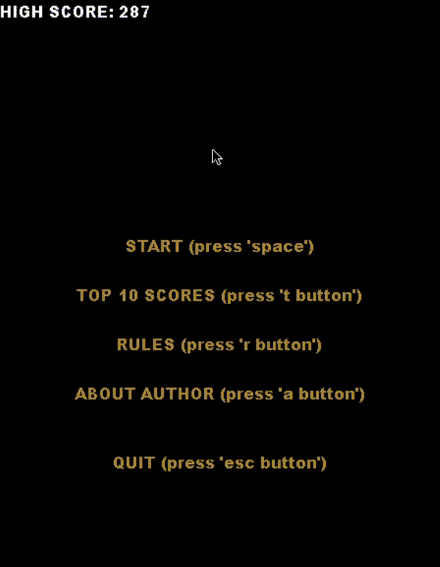

# Gra Pac-Man
## Gra wzorowana na arkadowej grze Pac-Man.
Aplikacja jest grą napisaną w języku Python. Jest ona adaptacją gry Pac-Man, której oryginał powstał w 1980 r.
## Uruchomienie aplikacji
Do uruchomienia aplikacji potrzebny jest zainstalowany <b><em>[Python](https://www.python.org/downloads/)</em></b> oraz moduł <b><em>pygame</em></b>, który możemy zainstalować wpisując w wierszu poleceń nastepujące polecenie:

```shell
pip install pygame
```

Należy pobrać następujące pliki znajdujące się w repozytorium:
 - <b><em>app.py</em></b>,
 - <b><em>main.py</em></b>,
 - <b><em>ghost.py</em></b>,
 - <b><em>pacman_player.py</em></b>,
 - <b><em>settings.py</em></b>,
 - <b><em>background.png</em></b>,
 - <b><em>eat.wav</em></b>,
 - <b><em>win.wav</em></b>,
 - <b><em>game_over.wav</em></b>,
 - <b><em>pacman_dead.wav</em></b>,
 - <b><em>highscores.txt</em></b>,
 - <b><em>walls.txt</em></b>.

Następne kroki należy wykonać z poziomu folderu, w którym znajdują się pobrane pliki.<br>
Należy uruchomić plik <b><em>main.py</em></b>.<br>
Można to zrobić z wiersza poleceń wpisując w nim następujące polecenie:

```shell
python main.py
```
lub w dowolnym edytorze, z którego korzystamy.<br><br>
Po uruchomienie pliku otworzy się okno aplikacji, z której możemy korzystać lokalnie.

## Demo aplikacji


